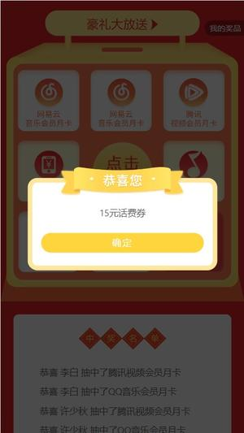

# lotteryEggJs

抽奖服务端接口

## 简介

简单的抽奖h5应用
前端框架：vue3 + vite + vantUI + pinia + vueRouter
后端框架：eggJS + mongodb + jwt

## 前端仓库地址

[前端项目仓库地址](https://github.com/JadeXusq/lottery/tree/develop-restApi)

## 接口文档地址

[文档地址](https://www.apifox.cn/apidoc/shared-88cc06f1-4877-4ebd-ad7e-0e426df29c9e)

## 项目截图




## QuickStart

### Development

```bash
npm i
npm run dev
```

### Deploy

```bash
npm start
npm stop
```

### npm scripts

- Use `npm run lint` to check code style.
- Use `npm test` to run unit test.
- Use `npm run autod` to auto detect dependencies upgrade, see [autod](https://www.npmjs.com/package/autod) for more detail.
